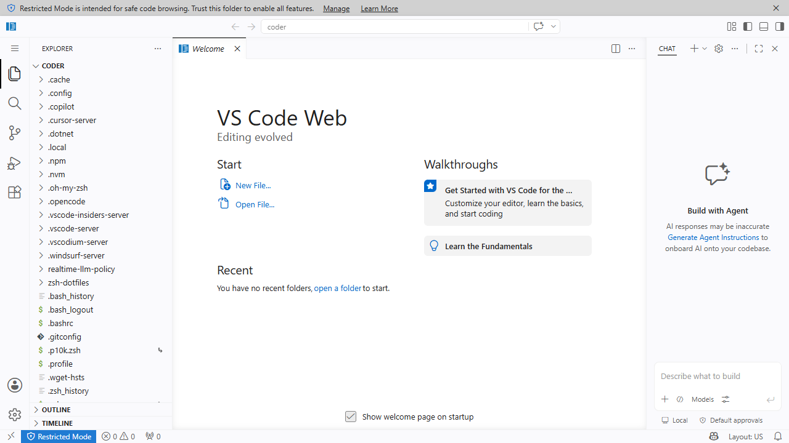

VS Code Webは、ブラウザ上で動作するVisual Studio Code環境です。手元のPCへEditorをインストールせずにWorkspaceを利用できます。Editorの基本操作は[Visual Studio Code公式ドキュメント](https://code.visualstudio.com/docs)を参照してください。

## 開く

1. Coderで利用するWorkspaceをStartします。
2. Workspace画面に表示される **VS Code Web** を選択します。
3. ブラウザ内にEditorが表示されることを確認します。



## 初回設定

初めて開いたWorkspaceには、個人の拡張機能や設定がまだ存在しない場合があります。研究内容に必要な拡張機能をWorkspaceごとに導入してください。

## 作業場所

ProjectやNotebookなど、保持したいファイルは次のDirectory以下へ保存します。

```text
/home/coder
```

例:

```text
/home/coder/projects/my-research
/home/coder/data
/home/coder/notebooks
```

保存ルールの詳細は[ファイルと永続化](persistence/)を参照してください。

## 開かない場合

ブラウザの再読み込み、別のブラウザ、Private Windowを試します。それでも開かない場合はWorkspaceのTerminalが利用できるか確認し、結果を管理者へ伝えてください。

## Next steps

- [VS Code Desktop](vscode-desktop/) — 手元のVS Code DesktopからCoder Workspaceへ接続する方法を説明します。
- [Workspaceの操作](lifecycle/) — WorkspaceのStart、Stop、Restart、Deleteと日常的な運用方法を説明します。
