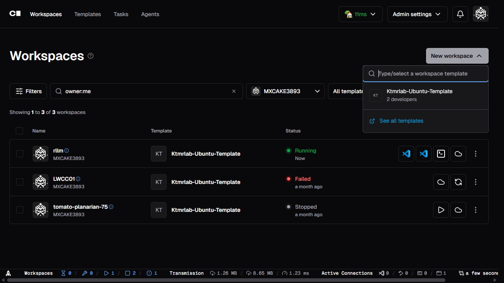
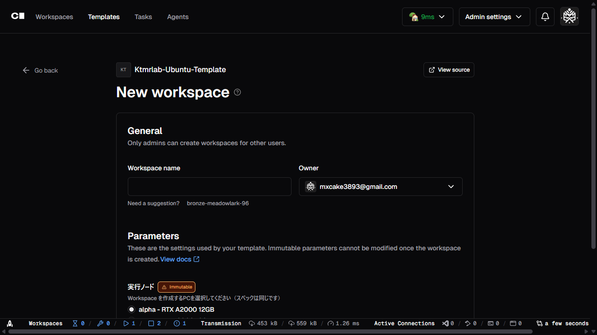
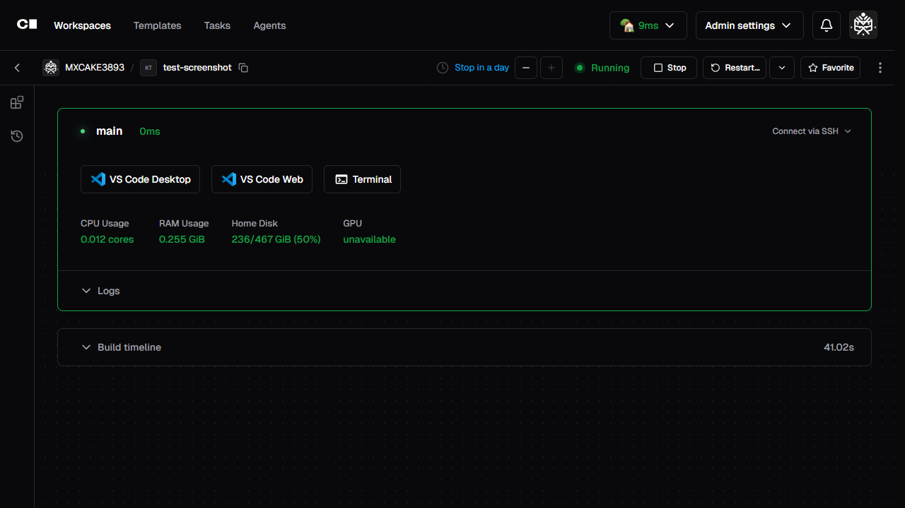

Coderへログインしたら、自分専用の開発環境となるWorkspaceを作成します。本ガイドを完了すると、VS Code Webから研究コードの実行を開始できます。

## 作成手順

1. CoderのDashboardで **New workspace** をクリックします。

2. 管理者から案内されたTemplateを選択します。

3. Workspace名を入力します。ランダムに生成された名前でも構いません。

4. 利用可能な実行先（alpha/beta）から、負荷状況を考慮して選択します。
5. **Create workspace** をクリックして作成を実行し、Workspaceが起動するまで待ちます。

初回はContainer Imageの取得や初期化により、通常より時間がかかる場合があります。

## 実行先の選択

実行先はいずれもRTX A2000 12GBを搭載しています。同じ実行先で複数の利用者がGPUを使用すると、処理速度に影響します。

:::caution
作成後にWorkspaceの実行先を簡単に変更することはできません。変更が必要な場合は、新しいWorkspaceを作成してデータを移行します。
:::

## 作成後の確認

Workspaceが起動したら、最初に[VS Code Web](../../coder/vscode-web/)を開いて動作を確認することを推奨します。

## Next steps

- [VS Code Web](../../coder/vscode-web/) — Coder Workspaceをブラウザ上のVS Code Webで開く方法を説明します。
- [ファイルと永続化](../../coder/persistence/) — Workspace内で保持されるファイルの保存先とBackup方法を説明します。
