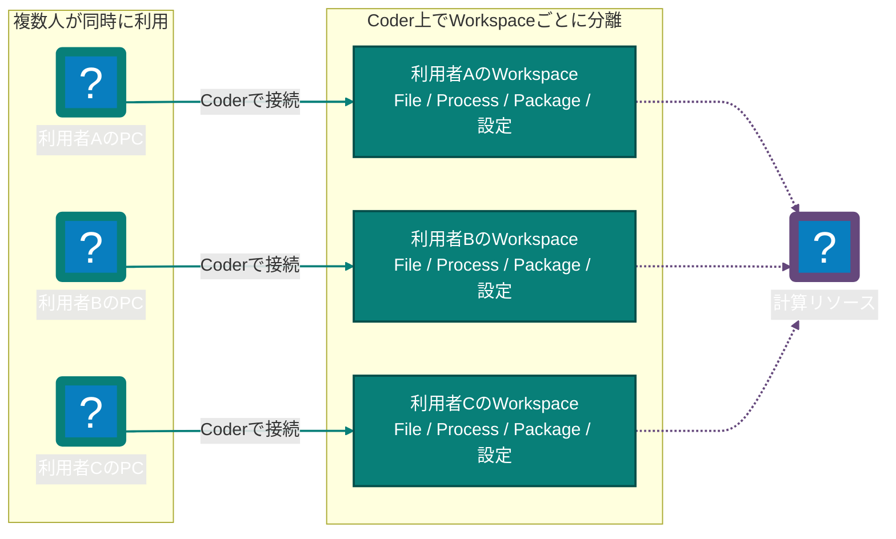

import { Card, CardGrid } from "@astrojs/starlight/components";

喜多村研究室では、個人のPCごとに開発環境を作り直す代わりに、研究室が管理する共通の計算環境を利用できます。このページでは、利用できる環境の概要と、利用開始までに読むページの順序を説明します。

## 研究のための共通基盤

Coder上の独立したWorkspaceから、ブラウザやVS Code Desktopで研究コードを実行できます。Workspaceは必要なときに起動し、保存したファイルはWorkspaceごとに保持されます。

### Workspaceごとに分離された環境

複数人が同時にCoderへ接続しても、利用者はそれぞれ独立したWorkspaceを使用します。あるWorkspaceでFileを変更したりPackageを追加したりしても、他の利用者のWorkspaceは変更されません。

Workspaceごとに、File、Process、Package、開発Toolの設定、VS CodeやTerminalの接続先が分離されます。

  
Development<strong>Coder Workspace</strong>

  
Compute<strong>RTX A2000 12GB</strong>

  
Access<strong>VS Code Web / Desktop</strong>

<CardGrid>
  <Card title="すぐに使える" icon="rocket">
    Linuxと[開発ツール](../guides/development-tools/)を備えたWorkspaceを作成し、初期構築を減らして研究コードの実行から始められます。
  </Card>
  <Card title="環境を分離できる" icon="seti:lock">
    依存ライブラリや実験環境はWorkspaceごとに分離され、手元のPCへ複雑なPackageを導入する必要がありません。
  </Card>
  <Card title="共有GPUを利用できる" icon="seti:config">
    RTX A2000 12GBを、機械学習、Data解析、3D処理などの計算に利用できます。
  </Card>
  <Card title="使い慣れた方法で接続" icon="laptop">
    VS Code Web、Terminal、VS Code Desktopから同じWorkspaceへ接続できます。
  </Card>
</CardGrid>

## 利用開始の流れ

初めて利用する場合は、次の順番で進めてください。

1. [利用対象と申請](application/) — システムを利用できる人と申請方法を確認します。
2. [利用前の準備](prerequisites/) — 必要なAccount、Browser、Editorを準備します。
3. [初回ログイン](first-login/) — 管理者から案内された接続先へ初めてログインします。
4. [Workspaceを作成する](create-workspace/) — 自分の開発環境を作成して起動します。

Workspaceを作成した後の接続方法やFile管理は、[Coder Workspace概要](../coder/)から確認できます。提供中・準備中・検討中の機能は、[研究システム](../systems/)と[提供状況](../systems/status/)に分けて掲載しています。
