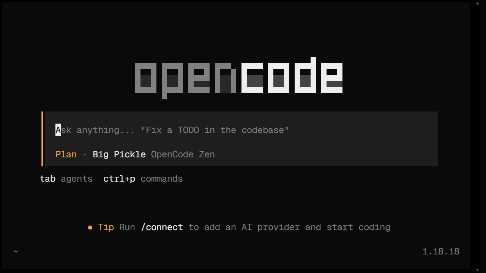
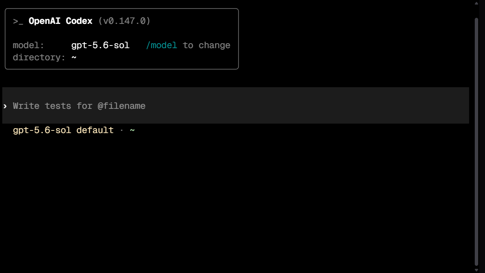
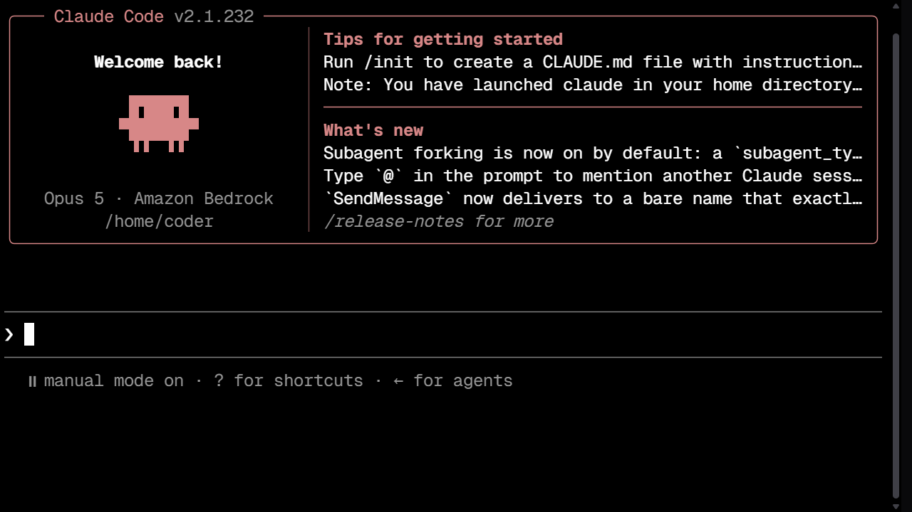

Coder Workspaceには、Terminalから利用するAI Coding Agentが導入されています。コードの説明、下書き、修正案、テスト作成などを支援できますが、生成結果をそのまま実行・Commitせず、必ず内容を確認してください。

## 利用できるAgent

| Agent | 起動Command | 用途 | 公式ドキュメント |
| --- | --- | --- | --- |
| [OpenCode](https://opencode.ai/) | `opencode` | Terminalで操作するコーディングAgent。複数のLLMに対応 | [OpenCode Docs](https://opencode.ai/docs) |
| [Claude Code](https://www.anthropic.com/claude-code) | `claude` | 大規模なコードベースの編集・リファクタリングに向くAgent | [Claude Code Docs](https://docs.anthropic.com/en/docs/claude-code/overview) |
| [Codex](https://openai.com/codex/) | `codex` | OpenAIのモデルを使うコーディングAgent | [Codex Docs](https://developers.openai.com/codex/) / [Codexのログイン](codex-login/) |

導入済みかどうかは、次のCommandで確認できます。

```bash
opencode --version
claude --version
codex --version
```

各Commandでバージョン情報が表示されれば、そのAgentを利用できます。

## 利用料金とプラン

Codex、Claude Code、OpenCodeの料金はそれぞれ独立しています。

| Agent | 無料で使えるか | 有料利用 | 備考 |
| --- | --- | --- | --- |
| [Codex](https://learn.chatgpt.com/docs/codex/cli) | 無料のChatGPTアカウントで利用可能（無料枠は制限キツめ [Codex使用上限](https://chatgpt.com/codex/cloud/settings/analytics#usage)を確認） | ChatGPT Plus / Pro / Business / Enterprise | 1つのChatGPTアカウントで認証 |
| [Claude Code](https://code.claude.com/docs/ja/overview) | 不可 | Claude Pro / Max のサブスクリプション、またはAnthropic API key | Anthropicのモデルのみ対応 |
| [OpenCode](https://opencode.ai/ja) | ログイン不要で**一応**無料枠あり | 利用するLLMの課金に準じる | 標準で複数のLLMプロバイダに対応 |

:::caution
~~ChatGPTのサブスクリプション認証をOpenCodeなどの他のAgentツールで利用できる場合がありますが、公式サポートの対象外となり得ます。利用は自己責任で判断してください。~~

OpenAIのCodex担当者は、ChatGPTアカウントでのサインインに対応するOpenCodeなどのOSSクライアントで、ChatGPTアカウントに含まれる利用枠を使うことは問題ないと案内しています。Anthropic、Googleでは明確に規約違反としています。

> You are completely fine if you use your subscription through Sign in With ChatGPT, either through the official clients or through one of the many OSS clients (Pi, OpenCode, ...) that support signing in with your account and using your included usage.
>
> [Tibo (@thsottiaux) による投稿](https://x.com/thsottiaux/status/2090675027670978569)
:::

## 基本的な使い方

Project Directoryへ移動してから、使用するAgentを起動します。

```bash
cd /home/coder/projects/my-research
opencode
```

Agentへの依頼では、**目的、対象ファイル、期待する動作、制約**を具体的に伝えると、結果を確認しやすくなります。例えば次のように依頼します。

> `src/analysis.py` の `main` 関数を、引数で入力CSVのパスを受け取る形に修正してください。既存の関数は削除せず、Python 3.12互換でお願いします。

変更提案を受けたら、差分とテスト結果を自分で確認してください。

各AgentのTerminal画面は次の通りです。







## 安全な利用

- API Key、Token、Password、秘密鍵をPromptへ入力しない
- 未公開の研究データや個人情報を、承認なく外部Serviceへ送信しない
- Agentが実行を提案したCommandと変更内容を確認してから実行する
- 生成コードをCommitする前に、`git diff`とテスト結果を確認する

:::note
OpenCode、Claude Code、CodexのCLIは導入済みです。研究室向けLLM APIを初期状態から利用するための標準設定は準備中です。認証情報、接続先、利用可否は管理者からの案内に従ってください。
:::

## Next steps

- PackageやCLIの標準環境を確認する: [開発ツール](../development-tools/)
- 変更履歴とBackupを管理する: [GitとGitHub](../git-github/)
- Python Projectを再現可能にする: [Python環境](../python/)
