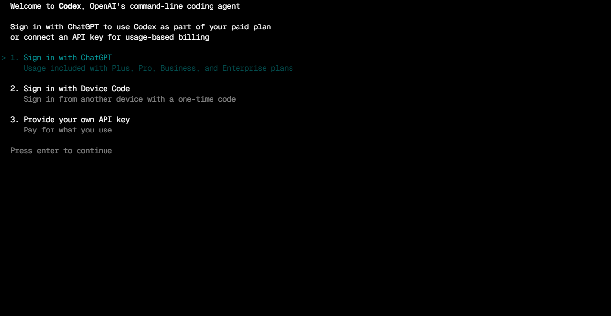
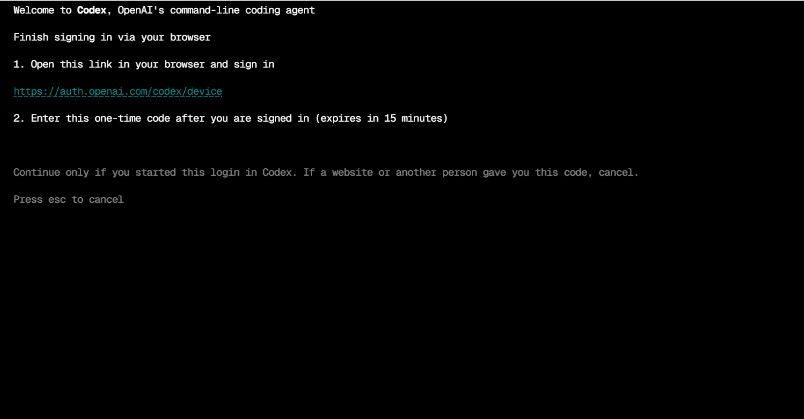
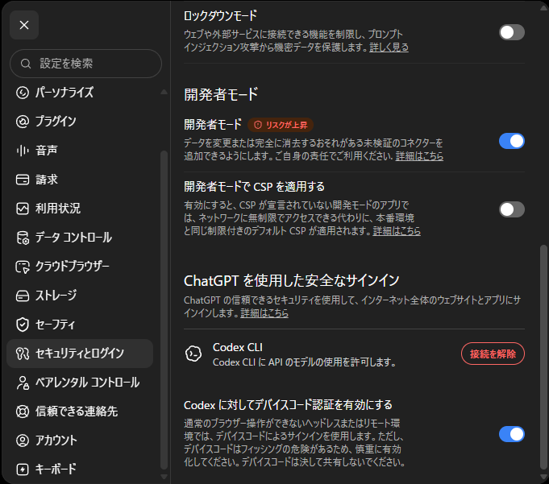

Coder Workspaceでは、TerminalのみでCodexを利用します。このページでは、Codexの初回認証（ログイン）の手順、料金プランの確認方法、利用後のログアウト方法を説明します。

## 利用料金

Codexは無料のChatGPTアカウントで利用できます（回数制限あり）。多くの利用を想定する場合は、ChatGPT Plus / Pro / Business / Enterprise のサブスクリプションを利用します。

:::note
Codex以外のAgent（Claude Code、OpenCode）の料金は、[AI Coding Agent](../ai-coding-agents/)の「利用料金とプラン」を参照してください。
:::

## ログイン方法の比較

Codexを初めて起動すると、次の3つの方法から選べます。



| 方法 | 仕組み | Workspaceでの利用 |
| --- | --- | --- |
| Sign in with ChatGPT | 表示されるURLをブラウザで開き、ChatGPTでサインインする | 利用可。ただしTerminalのみの環境ではクセがある |
| **Sign in with Device Code** | 自分の端末のブラウザでURLを開き、一度きりのコードを入力する | **推奨。** 追加設定なしで完了 |
| Provide your own API key | OpenAI API keyを接続し、従量課金で利用 | 研究室のAPI Endpointが案内されたらこちらになる（管理者の案内に従う） |

WorkspaceはTerminalから接続する環境のため、Sign in with ChatGPTを選ぶと、OAuthのCallback用のブラウザをWorkspace内側で用意する必要があります。VS CodeのPort Forwardingで対応できそうですが、研究室はTailscaleで接続しているため、安定した案内が難しい状態です。

そのため、**Sign in with Device Code** を推奨します。自分のPCなどの別の端末のブラウザを使えば、Port Forwardingや追加設定なしで認証を完了できます。

## Device Codeでログインする

1. Project Directoryで`codex`を実行します。

   ```bash
   cd /home/coder/projects/my-research
   codex
   ```

2. 初回起動のメニューで`2. Sign in with Device Code`を選び、Enterを押します。

3. WorkspaceのTerminalに、URLと一度きりのコード（有効期限15分）が表示されます。

   

4. 自分の端末のブラウザで`https://auth.openai.com/codex/device`を開き、ChatGPTにサインインします。
5. 表示されたページに、Terminalのコードを入力してサインインを完了します。
6. WorkspaceのTerminalに戻ると、認証の完了が表示されます。

:::caution
Device Codeは15分で失効します。また、Device Codeは一度きりの認証用です。Webサイトや他人から受け取ったコードは入力せず、自分がWorkspace側で始めたLoginにのみ使用してください。
:::

## 利用後のログアウト

認証情報は個人アカウントに紐付くため、想定外の事態における影響範囲を抑えるよう、利用が終わったら認証情報を解除しておきます。

1. WorkspaceのTerminalで、次のCommandを実行します。ローカルの認証情報（`~/.codex/auth.json`）が削除されます。

   ```bash
   codex logout
   ```

2. 必要な場合は、ChatGPT側からセッションも解除します。
   - Codex CLIの接続だけ解除する: ChatGPTのSettings（右上のプロフィールアイコンから）→ セキュリティとログイン → 「ChatGPT を使用した安全なサインイン」→ Codex CLIの**接続を解除**
   - 全デバイスのセッションをすべて終了する: Settings → Security → **Log out all**（他デバイスのセッションには最大30分ほどかかる場合があります。[公式Help](https://help.openai.com/en/articles/9243857-how-do-i-log-out-of-all-of-my-devices)）



## 今後の予定

現在、研究室PCでのローカルLLM接続の検討を進めています。接続先や認証方法が決定次第、このDocsで案内します。

:::note
研究室向けLLM APIの標準設定は準備中です。API key方式の利用開始は、管理者からの案内に従ってください。
:::

## Next steps

- Agentの比較と安全な利用: [AI Coding Agent](../ai-coding-agents/)
- 変更履歴の管理: [GitとGitHub](../git-github/)
- トラブルシューティング: [トラブルシューティング](../../operations/troubleshooting/)
