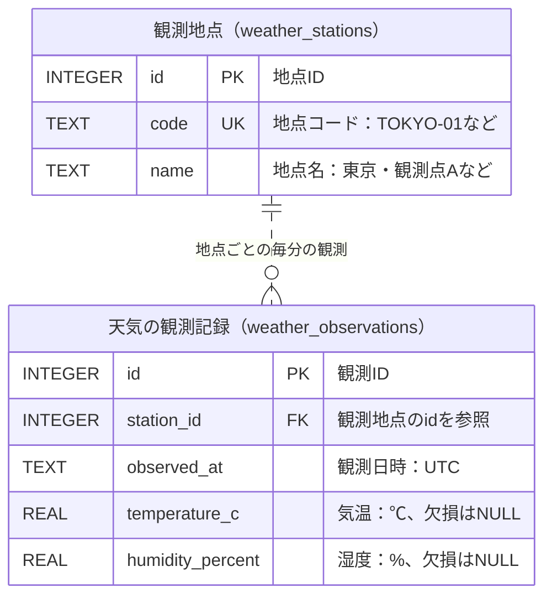

基本操作で登録した東京・大阪の地点について、気温と湿度を1分ごとに保存することを考えます。地点の情報は、すでに `example.db` の `weather_stations` にあります。

## 現状のDB構成

基本操作で作ったのは、次の2件です。

| id | code | name |
| --- | --- | --- |
| 1 | TOKYO-01 | 東京・観測点A |
| 2 | OSAKA-01 | 大阪・観測点B |

## 天気を記録する表

**1地点・1観測時刻の気温と湿度を1行に保存します。** 1分後の観測は新しい行として追加します。観測記録の表には、地点・観測日時・気温・湿度が必要です。

例えば、既存のテーブルに追加で一緒に保存すると、次のようになります。

| 観測ID | 地点コード | 地点名 | 観測日時（UTC） | 気温（℃） | 湿度（%） |
| --- | --- | --- | --- | --- | --- |
| 1 | TOKYO-01 | 東京・観測点A | 2026-09-01T00:00:00Z | 28.4 | 65.0 |
| 2 | OSAKA-01 | 大阪・観測点B | 2026-09-01T00:00:00Z | 29.1 | 70.0 |
| 3 | TOKYO-01 | 東京・観測点A | 2026-09-01T00:01:00Z | 28.5 | 64.0 |

### 地点名を毎回保存するとどうなるか

東京の観測が増えるたびに、`TOKYO-01` と `東京・観測点A` が繰り返し保存されます。この情報は、すでに地点表にもあります。

地点名を訂正する場合、地点表だけでなく、同じ地点の全観測行も変更しなければなりません。一部だけ直すと、同じ地点なのに名前が食い違います。こうした更新による不整合を**更新異常**と呼びます。

## 地点IDで関連付ける

**観測表には地点IDを保存し、コードと名前は地点表に置きます。** 地点IDが1なら東京、2なら大阪と分かるためです。

観測表 `weather_observations` は次の形にします。

| 観測ID<br/>`id` | 地点ID<br/>`station_id` | 観測日時（UTC）<br/>`observed_at` | 気温（℃）<br/>`temperature_c` | 湿度（%）<br/>`humidity_percent` |
| --- | --- | --- | --- | --- |
| 1 | 1 | 2026-09-01T00:00:00Z | 28.4 | 65.0 |
| 2 | 2 | 2026-09-01T00:00:00Z | 29.1 | 70.0 |
| 3 | 1 | 2026-09-01T00:01:00Z | 28.5 | 64.0 |

地点名の訂正は地点表の1行だけで済み、観測表は変更しません。観測を削除しても、地点の情報は地点表に残ります。

このように、**データの依存関係に合わせて表を整理し、重複による不整合を防ぐことを正規化と呼びます。** 地点名は地点ごとに決まり、気温・湿度は地点と観測時刻ごとに決まるので、別々の表に保存します。

## テーブルの関係



**ER図**はデータとその関係を表す図です。[`PK`（主キー）](../#基本用語)、[`FK`（外部キー）](../#基本用語)、`UK`（重複を許さないキー）を示します。1地点に0件以上の観測が対応し、各観測は必ず1地点を参照する **1対多** の関係です。「地点ID＋観測日時」も一意にします。

## 外部キー

**存在しない地点の観測を保存させないために、外部キーを使います。** 観測表の `station_id` が、地点表の `id` を参照するように定義します。

```sql
PRAGMA foreign_keys = ON;

CREATE TABLE weather_observations (
  id INTEGER PRIMARY KEY,
  station_id INTEGER NOT NULL REFERENCES weather_stations(id),
  observed_at TEXT NOT NULL,
  temperature_c REAL CHECK (temperature_c >= -273.15),
  humidity_percent REAL CHECK (humidity_percent BETWEEN 0 AND 100),
  UNIQUE (station_id, observed_at)
) STRICT;
```

`REFERENCES weather_stations(id)` が参照先の指定です。地点表にはIDが1と2しかないため、地点IDが99の観測を追加すると拒否されます。

`PRAGMA foreign_keys = ON;` は外部キーの検査を有効にします。`UNIQUE (station_id, observed_at)` は同じ地点・時刻の観測の二重登録を拒否します。表の作成・データの追加・検索の基本は、[基本操作](../table-design/)で確認できます。

<details>
<summary>補足：地点情報の履歴</summary>

地点名を変更すると、過去の観測も変更後の名前で表示されます。観測時点の名前・場所を残す必要があるなら、地点情報の履歴や版を管理します。地点が移転する場合も、同じIDを使い続けてよいか検討します。

</details>

<details>
<summary>補足：関数従属性と第1〜第3正規形</summary>

**関数従属性**は、ある値が決まると別の値も一意に決まる関係です。この例では、地点コードが決まれば地点名が決まります。保存した数行が同じ値かではなく、データ全体の仕様で判断します。

**正規形**は、依存関係などの条件による整理段階です。

| 段階 | 着眼点 | 天気データでの例 |
| --- | --- | --- |
| 第1正規形 | 複数値の詰め込みや繰り返し列を避ける | 1地点・1時刻の観測を1行にする |
| 第2正規形 | 候補キーの一部だけに依存する情報を分ける | 「地点＋日時」がキーなら、地点だけで決まる地点名を分ける |
| 第3正規形 | キー以外の情報を経由する依存を分ける | 「観測ID → 地点コード → 地点名」の地点名を別表へ移す |

**候補キー**は、行を一意に識別できる最小の列の組み合わせです。そのうち選んだものが主キーで、複数列のキーを**複合キー**と呼びます。第2・第3正規形は前段階の条件も満たします。

表は要点です。厳密な第3正規形では、自明でない依存 `X → A` のそれぞれについて、Xが行を一意に識別できるか、Aがいずれかの候補キーに含まれることを確認します。整数IDを追加するだけでは、地点名の重複は解決しません。

</details>

外部キーの詳しい条件は、[SQLite公式の外部キーガイド](https://sqlite.org/foreignkeys.html)を参照してください。

## Next steps

- [基本操作](../table-design/) — 地点表の作成・データの追加・検索の手順を確認します。
- [DB用語集](../glossary/) — 主キーや外部キーなど、テーブル設計で使う用語を確認します。
