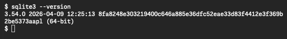

**`sqlite3` は、SQLiteのDBへSQLを入力するコマンドです。** このページではOS別の導入方法を説明します。

WindowsはPowerShell、macOS・UbuntuはTerminalでコマンドを入力します。`--version` はバージョンの表示です。`3.` で始まる番号などが表示されれば起動できています。このガイドの共通スキーマにはSQLite 3.37.0以降を使います。



画像はmacOSで実行した画面です。表示されるバージョンは環境によって異なります。先頭の `$` は入力待ちの記号で、入力しません。

## Windows

1. 「設定 → システム → バージョン情報」で、x64かARM64か確認します。
2. [公式ダウンロードページ](https://sqlite.org/download.html)の **Precompiled Binaries for Windows** から、対応する `sqlite-tools-win-x64-` または `sqlite-tools-win-arm64-` のZIPを選びます。`sqlite-dll-` はコマンド用ではありません。
3. ZIPを展開し、`sqlite3.exe` のあるフォルダでPowerShellを開きます。エクスプローラーのアドレスバーへ `powershell` と入力して開けます。

```powershell
.\sqlite3.exe --version
```

`.\` は現在のフォルダです。基本操作のページにある `sqlite3` は、Windowsでは `.\sqlite3.exe` に置き換えます。

## macOS

導入済みなら次で確認できます。

```bash
sqlite3 --version
```

見つからない、または必要なバージョンより古い場合は、ソフト管理ツールの[Homebrew](https://brew.sh/)を導入した環境で次を実行します。

```bash
brew install sqlite
"$(brew --prefix sqlite)/bin/sqlite3" --version
```

`brew install` は導入、`brew --prefix sqlite` は導入先の取得です。`$(...)` で取得したパスを埋め込み、引用符でパスをひとまとまりにします。Homebrew版を使う場合は、基本操作のページにある `sqlite3` もこのパスに置き換えてください。OS標準版と共存するためです。詳細は[HomebrewのSQLiteページ](https://formulae.brew.sh/formula/sqlite)を参照してください。

## Ubuntu

導入済みなら `sqlite3 --version` で確認できます。見つからない場合は、パッケージ管理ツール `apt` で導入します。

```bash
sudo apt update
sudo apt install sqlite3
sqlite3 --version
```

`sudo` は管理者権限での実行、`apt update` は配布一覧の更新、`apt install` は導入です。確認画面の内容を読んで進めてください。配布バージョンはUbuntuの版で異なります。[Ubuntuのパッケージ情報](https://packages.ubuntu.com/noble/sqlite3)は24.04 LTSの例です。

次は[基本操作](../table-design/)で、表を作り、地点を1件保存して読み出します。
