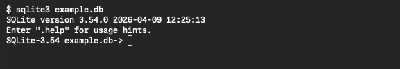

観測地点のデータを保存して読み出します。[SQLiteの導入](../sqlite-installation/)で準備した `sqlite3` を使います。

## 1. DBを開く

`example.db` というファイルに保存します。ファイルがない作業フォルダで、次を入力してください。

```bash
sqlite3 example.db
```

Windowsでは `sqlite3` を `.\sqlite3.exe` に、macOSでHomebrew版を使う場合は `"$(brew --prefix sqlite)/bin/sqlite3"` に置き換えます。



画像はmacOSの実画面です。`sqlite>` や `SQLite-3.54 example.db->` は入力待ちの記号です。ここからはSQLを入力します。記号自体は入力しません。

## 2. テーブルを作る

地点のID・コード・名前を、次の3列に保存します。表の名前は `weather_stations` です。

| 列名 | 保存する値 | 例 |
| --- | --- | --- |
| `id` | 地点を識別する整数 | `1` |
| `code` | 地点コード | `TOKYO-01` |
| `name` | 地点名 | `東京・観測点A` |

**`CREATE TABLE` は表を作るSQLです。** 次を入力します。

```sql
CREATE TABLE weather_stations (
  id INTEGER PRIMARY KEY,
  code TEXT NOT NULL UNIQUE,
  name TEXT NOT NULL
) STRICT;
```

括弧の中に列を並べ、SQLの末尾に `;` を付けます。`INTEGER` は整数、`TEXT` は文字列の指定です。

作成できたか、次で確認します。先頭が `.` の操作は `sqlite3` 専用のコマンドで、末尾に `;` は付けません。

```text
.tables
```

次の名前が表示されれば、表が作成できています。

```text
weather_stations
```

## 3. データを追加する

**`INSERT INTO` は行を追加するSQLです。** 東京の地点を登録します。

```sql
INSERT INTO weather_stations (id, code, name)
VALUES (1, 'TOKYO-01', '東京・観測点A');
```

`(id, code, name)` が保存先の列、`VALUES (...)` が同じ順序の値です。文字列は `'...'` で囲みます。

## 4. データを検索する

列名を表示し、結果を列ごとにそろえます。

```text
.headers on
.mode column
```

**`SELECT` は保存したデータを読み出すSQLです。**

```sql
SELECT id, code, name FROM weather_stations;
```

`SELECT` の後に取得する列を、`FROM` の後に表を指定します。結果は次の1件です。

| id | code | name |
| --- | --- | --- |
| 1 | TOKYO-01 | 東京・観測点A |

これが1行のデータです。`id`・`code`・`name` がそれぞれ列で、1地点の情報をまとめて1行に保存しています。

## 5. データ型と制約

表を作ったSQLでは、列名の後に**型**と**制約**を指定しました。型は値の種類、制約は保存できる値のルールです。

| 定義 | この表での意味 |
| --- | --- |
| `id INTEGER PRIMARY KEY` | 整数のIDで行を一意に識別する。これを[主キー](../glossary/#主キー)と呼ぶ |
| `code TEXT NOT NULL UNIQUE` | コードは文字列。[値を必須にし](../glossary/#not-null)、[同じコードの重複を拒否する](../glossary/#unique) |
| `name TEXT NOT NULL` | 名前は文字列。値を必須にする |
| `STRICT` | 宣言した型に変換できない値を拒否する。SQLite 3.37.0以降で利用できる |

例えば、すでに登録した `TOKYO-01` を別の地点にも使うと、`UNIQUE` によって追加が拒否されます。地点IDは識別用の番号であり、件数や順位ではありません。

<details>
<summary>補足：必須項目と型の検査</summary>

`NOT NULL` は値の欠損を禁止しますが、空文字 `''` は禁止しません。コードや名前の表記は入力側でも検査します。`STRICT` も、変換可能な値は宣言した型に変換して受け入れます。

</details>

## 6. データをもう1件追加する

大阪の地点も同じ表に追加します。

```sql
INSERT INTO weather_stations (id, code, name)
VALUES (2, 'OSAKA-01', '大阪・観測点B');

SELECT id, code, name FROM weather_stations ORDER BY id;
```

`ORDER BY id` はID順の表示を指定します。結果は2件になります。

| id | code | name |
| --- | --- | --- |
| 1 | TOKYO-01 | 東京・観測点A |
| 2 | OSAKA-01 | 大阪・観測点B |

## 7. 終了する

次を入力して `sqlite3` を終了します。

```text
.quit
```

作成した表と登録した2地点は `example.db` に保存されています。同じ作業フォルダで `sqlite3 example.db` を実行すれば、再び開けます。

## 公式リファレンス

- [CREATE TABLE](https://sqlite.org/lang_createtable.html) — 列・型・制約の定義方法。
- [SQLiteのデータ型](https://sqlite.org/datatype3.html) — 型変換と値の保存形式。
