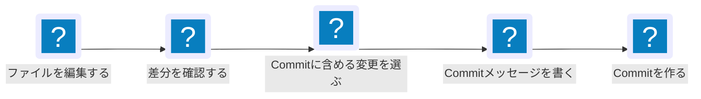
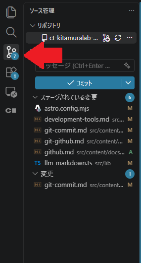
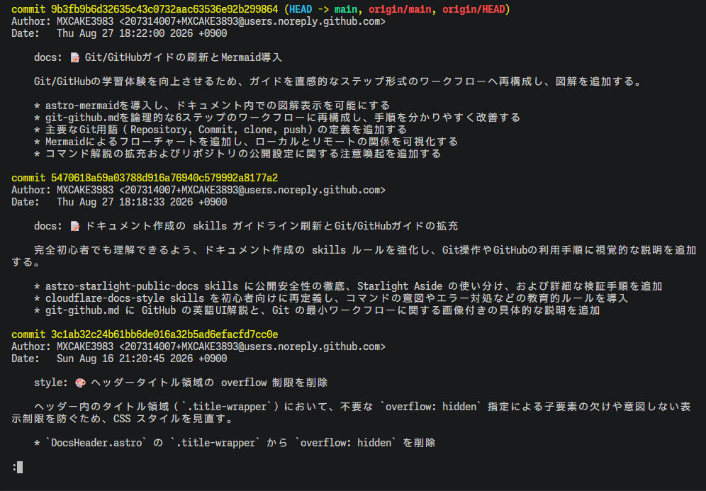

Commitは、選んだ変更をGitの履歴として記録する操作です。このページではVS Codeのソース管理タブを主に使い、編集したファイルを確認してからCommitします。Gitをまだ使い始めていない場合は、先に[Gitとは](../git-github/)を確認してください。

## 全体の流れ



## まず知っておくこと

VS Codeの**ソース管理**タブは、Gitが見つけた変更を確認し、Commitを作るための画面です。左側のActivity Barにある分岐した線のアイコンから開きます。次の画像では、赤い矢印がソース管理アイコンを示しています。



画面上の操作とGitコマンドは、次のように対応します。

| VS Codeの操作 | Gitコマンド | 役割 |
| --- | --- | --- |
| 変更一覧を見る | `git status` | 変更されたファイルを確認する |
| ファイルを開いて差分を見る | `git diff` | 変更内容を確認する |
| `+`を選んでステージする | `git add <ファイル名>` | 今回のCommitに含める変更を選ぶ |
| コミットを実行する | `git commit` | 選んだ変更を履歴として記録する |

## 0. Gitを作業フォルダに導入する

プログラムを作成するフォルダをVS Codeで開き、ソース管理タブの**リポジトリを初期化する**を押すか、ターミナル上で `git init`を実行する。

## 1. ファイルを編集する

Gitで管理している作業フォルダをVS Codeで開き、ファイルを追加・編集して保存します。保存すると、ソース管理タブの**変更**にファイル名が表示されます。

この表示は、前回のCommitからファイルが変わっていることを示します。まだ変更はCommitされていません。

## 2. 差分を確認する

ソース管理タブの**変更**からファイル名を選ぶと、変更前と変更後を並べて確認できます。

- 緑色または`+`が付いた行は、追加した内容です。
- 赤色または`-`が付いた行は、削除した内容です。

Terminalでは、次のコマンドでも同じ変更内容を確認できます。  
(`q`で閉じれます。quitの略です。)

```bash
git diff
```

例えば`message.txt`を作成して1行を変更すると、次のように表示されます。

```diff
-Hello
+Hello, Git
```

この例では、`Hello`を削除し、`Hello, Git`を追加しています。

:::caution
差分を確認せずにCommitすると、デバッグ用のファイル、秘密情報、意図しない変更まで履歴に残すおそれがあります。Commit前に、変更内容と対象ファイルを確認してください。
:::

## 3. Commitに含める変更を選ぶ

ソース管理タブの**変更**にあるファイルごとに、`+`ボタンを選びます。カーソルを対象のファイルにかざすと`+`ボタンが表示されます。選んだファイルは**ステージされている変更**へ移動します。

ステージとは、一時的なキャッシュです。複数の作業を同時に進めている場合でも、関係する変更だけを1つのCommitにできます。

すべての変更をまとめてCommitしてよい場合は、**変更**の見出しにある`+`ボタンを選べます。

Terminalでは、ファイルを指定して同じ操作を行います。

```bash
git add message.txt
```

もしくは、全変更をステージする場合は以下のとおりです。

```bash
git add .
```

フォルダの中にあるファイルの変更の場合。(`docs`フォルダの中の`message.txt`)

```bash
git add docs/message.txt
```

- `add`: 指定した変更をステージするサブコマンドです。
- `message.txt`: Commitに含めるファイル名です。
- `.`: 今いるディレクトリのファイルすべてを選択するものです。

## 4. Commitを作る

ソース管理タブ上部の入力欄に、今回何を変えたかを短く書きます。これを**Commitメッセージ**と呼びます。

例えば、次のように書きます。

```text
Add greeting message
```

入力後、**コミット**ボタンを選びます。ステージした変更がGitの履歴として記録されます。

Commitメッセージは、後から履歴を見た人が変更内容を判断するために使います。「update」のような曖昧な語だけではなく、何をしたかを書いてください。

| 分かりにくい例 | 分かりやすい例 |
| --- | --- |
| `update` | `Add: greeting message` |
| `fix` | `Fix: CSV loading error` |
| `changes` | `Update: experiment parameters` |

参考: [僕が考える最強のコミットメッセージの書き方](https://qiita.com/konatsu_p/items/dfe199ebe3a7d2010b3e)

Terminalで同じCommitを作る場合は、次のように実行します。

```bash
git commit -m "Add greeting message"
```

- `commit`: ステージした変更を履歴として記録するサブコマンドです。
- `-m`: Commitメッセージをコマンドに続けて指定するオプションです。
- `"Add greeting message"`: 今回のCommitメッセージです。

## 5. Commitを確認する

Commit後、ソース管理タブの**ステージされている変更**と**変更**が空であれば、作業フォルダに未記録の変更はありません。

Terminalでは、履歴を次のコマンドで確認できます。

```bash
git log --oneline
```

- `log`: Commit履歴を表示するサブコマンドです。
- `--oneline`: 1つのCommitを1行で短く表示するオプションです。

実際の`git log`では、CommitごとにCommit ID、作成者、作成日時、Commitメッセージなどが表示されます。次の画像は、Commit履歴を確認した例です。



次のように、Commitメッセージを含む行が表示されます。

```text
8f3a2c1 Add greeting message
```

先頭の文字列は、そのCommitを識別するためのIDです。番号は環境ごとに異なります。

## 次にすること

Commitは自分の作業フォルダに記録されています。GitHubへ保存・共有・バックアップする必要がある場合は、次のページでRepositoryを作成し、Commitを送ります。

## Next steps

- [GitHubへ保存する](../github/) - GitHubでRepositoryを作り、Commitをpush・pullする方法を説明します。
- [Gitとは](../git-github/) - RepositoryやCommitの基本概念を確認します。
