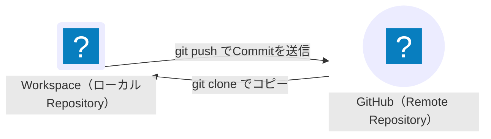
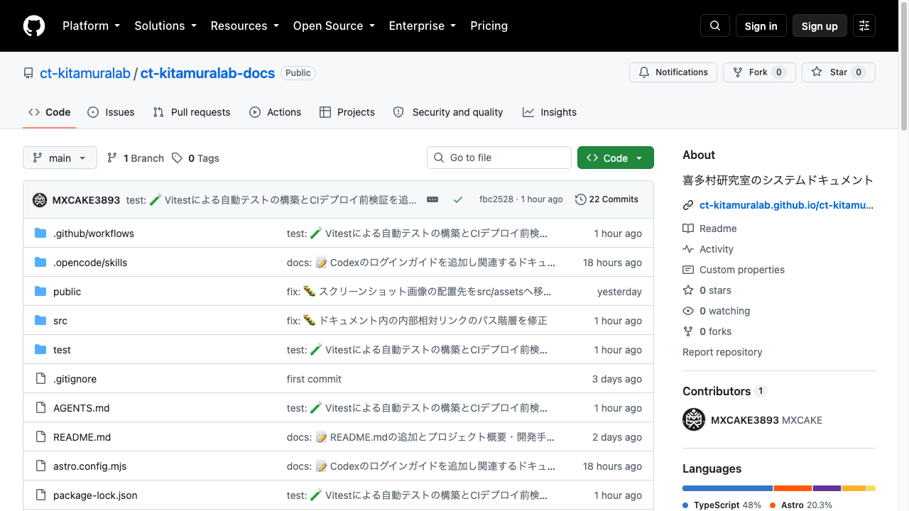
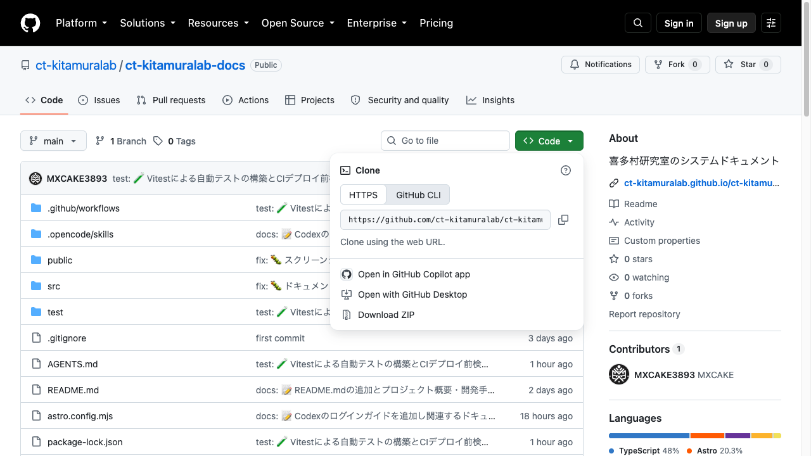

Gitはファイルの変更履歴を記録するためのVersion Control Systemで、GitHubはGitで管理したコードを保存・共有するためのWebサービスです。このページを読み終えると、WorkspaceでGitを設定し、GitHub上に新しいRepositoryを作って、自分の研究コードをpushできるようになります。Gitの基礎は[Pro Git](https://git-scm.com/book/ja/v2)（Gitの日本語解説書）、Repositoryの運用は[GitHub Docs](https://docs.github.com/ja)（GitHubの公式ドキュメント）で確認できます。

## まず知っておくこと

このページで使う用語を次のように説明します。

- **Repository**：Gitが管理するフォルダ。Workspace内に作ったものを**ローカルRepository**、GitHub上にあるものを**Remote Repository**と呼びます
- **Commit**：変更履歴に記録される1回の変更。`git commit` コマンドで記録します
- **clone**：GitHub上のRepositoryをWorkspace内へコピーすること
- **push**：Workspace内のCommitをGitHubへ送信すること

ローカルとRemoteのやり取りは次のようになります。



## 全体の流れ

1. Gitを設定する
2. GitHubで新規Repositoryを作る
3. Clone URLを取得する
4. Repositoryをcloneして作業ディレクトリを作る
5. コードを書いてcommit・pushする

## 前提条件

- GitHubのアカウントがあること。RepositoryはGitHubのアカウントに紐づけて作るためです。[github.com](https://github.com/)にログインできていれば、この前提は満たされています

## 1. Gitを設定する

GitはCommitに「誰が変更したか」（名前とメールアドレス）を記録します。まだ設定されていなければ、次のコマンドで確認します。

```bash
git config --global --list
```

- `git`: Gitを操作するコマンド
- `config`: Gitの設定を読み書きするサブコマンド
- `--global`: 自分のアカウント全体（Workspace内の全Repository）に適用することを示すオプション
- `--list`: 設定の一覧を表示するオプション

Workspaceでは、利用者の情報からGitのユーザー情報が自動設定されている場合があります。自動設定されている場合は、自分の名前とメールアドレスが次のように表示されます（例）。

```text
user.name=Your Name
user.email=you@example.com
```

`user.name` や `user.email` が表示されず、自分の情報になっていない場合は、次のように設定します。`"Your Name"` と `"you@example.com"` は、それぞれ自分の名前とメールアドレスに置き換えてください。

```bash
git config --global user.name "Your Name"
git config --global user.email "you@example.com"
```

- `user.name`: Commitに記録される名前
- `user.email`: Commitに記録されるメールアドレス。GitHub上のCommit表示にも使われます

設定が完了したことを確認します。先ほどの一覧コマンドを再度実行し、自分の名前とメールアドレスが表示されればOKです。

```bash
git config --global --list
```

:::note
設定していないまま `git commit` を実行すると、`Committer identity unknown` のエラーでCommitできません。エラーが出たら、この手順で名前とメールアドレスを設定してください。
:::

## 2. GitHubで新規Repositoryを作る

GitHub上に、研究コードを保存する場所を作ります。GitHubのアカウントでログインし、右上の **+** メニューから **New repository** を選ぶと、作成フォームが開きます。

- **Repository name**：リポジトリ名（`research-notes` のように英数字で付けます）
- **Description**：説明（任意）
- **Public / Private**：公開するか非公開にするかの切り替え。研究コードが外部に見えたら困る場合は **Private** にします
- **Add a README**：チェックすると空のREADMEが最初にCommitされます

:::caution
**Public** にすると、誰でもコードを見られます。研究コードや未公開の研究Dataを含むRepositoryは **Private** にしてください。
:::

最後に **Create repository** ボタンで確定すると、次の「GitHubの画面」に移動します。

## 3. GitHubの画面を見る

Repositoryページは英語で表示されます。左のファイル一覧、上部のタブ、緑の **Code** ボタンが主な操作入口です。



- **Code**（緑のボタン）：このリポジトリのコードをダウンロード（clone）するための場所
- **Branch**（`main` と表示）：作業するブランチの選択。通常は `main` のままです
- **Go to file**：リポジトリ内のファイルを名前から検索する欄
- **Issues / Pull requests / Actions**：問題・変更提案・自動処理のタブ。まずは `Code` に絞ります

## 4. Clone URLを取得する

緑の **Code** ボタンを押すと、ドロップダウンが開きます。ここに **Clone用のURL** が表示され、コピーボタンでコピーできます。



- **HTTPS / GitHub CLI**：上段のタブ。`git clone` には **HTTPS** 側を使う
- **コピーボタン**：URL欄の右にあるアイコンで、URLをコピーします
- このURLを `git clone` の引数に用います

## 5. Repositoryをcloneする

ここまででRepositoryはGitHub上にのみ存在し、Workspace内にはまだ何もありません。Workspaceでコードを編集するためには、まずRepositoryをWorkspace内へ持ってくる必要があります。これがcloneの役割です。

Terminalで、プロジェクトを置きたいディレクトリ（例: `/home/coder`）に移動してから、次のコマンドを実行します。

```bash
cd /home/coder
git clone https://github.com/YOUR-USERNAME/research-notes.git
cd research-notes
```

- `cd /home/coder`: プロジェクトを置きたいディレクトリへ移動するコマンド（`cd` = change directory）
- `git clone`: GitHub上のRepositoryを現在のディレクトリへコピーするコマンド。引数に4.でコピーしたClone URLを指定します（`YOUR-USERNAME` はGitHubのユーザー名です）
- `cd research-notes`: cloneで生成された `research-notes` フォルダへ移動するコマンド

cloneの成功を確認します。

```bash
ls
```

2.で **Add a README** にチェックした場合は、次のように表示されます。

```text
README.md
```

`research-notes` フォルダが作業ディレクトリになります。ここから研究コードを書き、commit・pushしていきます。`/home/coder` 以下に置いているため、Workspaceの再構築後も残ります。

## 6. コードを書いてcommit・pushする

`research-notes` フォルダに研究コードを書きます（テキストエディタやVS Codeでファイルを作成・編集します）。コードを編集したあと、編集ごとに次のコマンドを実行します。

```bash
git status            # 変更されたファイルを確認
git add .             # 変更をCommitへ追加
git diff --staged     # Commitに含める内容を確認
git commit -m "change description"
git push              # Remote Repositoryへ保存
```

- `git status`: 何が変更されたかを確認します。変更されたファイルは `modified:`、新規のファイルは `Untracked files:` と表示されます
- `git add .`: 変更をCommitに含める対象へ追加します。`.` は「現在のフォルダ配下の全変更」を示します
- `git diff --staged`: `git add` した内容がCommitに含められることを確認します。大きなDataや秘密情報を誤って含めていないか、ここで確認するのが安全です
- `git commit`: 変更を履歴に記録します。`-m` の後に変更内容の短い説明（Commit Message）を書きます
- `git push`: Remote Repository（GitHub側）へ保存します。cloneしたRepositoryは既にGitHubと紐づいているため、`git push` のみで構いません

`git push` が成功すると、Repositoryページのファイル一覧が更新され、GitHub側に最新の内容が表示されます。

:::tip
Commit Messageは「何を変えたか」が分かる短い英語で書くのが一般的です。例えば `add data loading script` のように書きます。
:::

cloneからpushまでの流れは、次のGIFも参考にしてください。


### コードのフォルダが既に手元にある場合

cloneする前にコードのフォルダを既に持っている場合は、フォルダ内でGitを初期化して、2.で作ったRepositoryと紐づけます。

```bash
cd /path/to/your-code
git init
git remote add origin https://github.com/YOUR-USERNAME/research-notes.git
```

- `git init`: 現在のフォルダでGitの管理（ローカルRepository）を開始するコマンド
- `git remote add origin`: 2.で作ったRepositoryを `origin` という名前で登録し、GitHub側と紐づけるコマンド。`origin` の後には4.でコピーしたClone URLを書きます

その後、`git status` → `git add .` → `git commit -m "initial commit"` → `git push -u origin main` の順で実行すると、GitHubに保存されます。`-u` を付けると、そのあとのpushで `origin main` を省略できるようになります。

各コマンドの役割とGitの基礎は[Pro Git](https://git-scm.com/book/ja/v2)で確認できます。

## GitHub CLIを使う

WorkspaceではGitHub CLI（`gh`）も利用できます。TerminalからRepository、Issue、Pull Requestを操作するためのツールで、初回利用はGitHubへの認証が必要です。

```bash
gh auth login
```

- `gh`: GitHub CLIを操作するコマンド
- `auth login`: GitHubへの認証（ログイン）を行うサブコマンド

画面の案内に従い、GitHubのブラウザ認証を完了します。認証が成功すると、次のようにRepositoryをTerminalからcloneできます。

```bash
gh repo clone YOUR-USERNAME/research-notes
```

`gh repo clone` には `YOUR-USERNAME/Repository名` の形式を指定します。Clone URLをコピーしなくてもよいのが便利です。

CLIによるGitHub操作は[GitHub CLI公式マニュアル](https://cli.github.com/manual/)（`gh` の全コマンドとオプションの解説）で確認できます。

:::caution
認証時に表示されるTokenや認証コードは他人に共有しないでください。
:::

## 推奨する運用

- 作業単位ごとにCommitする
- 研究コードを定期的にRemote Repositoryへpushする
- 大きなDataや生成物を無条件にGitへ追加しない
- `requirements.txt` や `pyproject.toml` など、環境を再現するファイルをCommitする
- `.gitignore` を確認する

大きなData（Dataset、モデルの生成物など）はGitへ追加せず、[ファイルと永続化](../../coder/persistence/)で説明する `/home/coder` 以下に保存し、必要に応じて別の保存先へ退避してください。

## 秘密情報をCommitしない

API Key、Token、Password、個人情報、未公開DataをGit RepositoryへCommitしないでください。

:::danger
秘密情報を一度pushすると、後からファイルを削除しても履歴に残ることがあります。Commit前に `git status` と差分を確認してください。
:::

## Next steps

- [開発ツール](../development-tools/) — Coder Workspaceに標準で導入される開発ツールと、用途別の公式ドキュメントを紹介します。
- [ファイルと永続化](../../coder/persistence/) — Workspace内で保持されるファイルの保存先とBackup方法を説明します。
