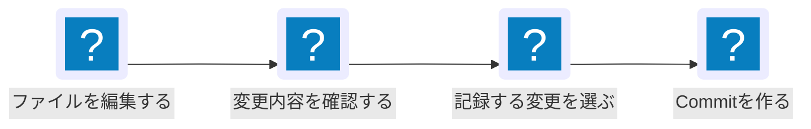

Gitは、ファイルの変更履歴を記録するツールです。コードを編集する前に記録を残しておくと、変更内容を確認したり、必要に応じて以前の状態を調べたりできます。このページでは、Gitが何を記録するのかと、作業フォルダでGitを使い始める方法を説明します。

## Gitでできること

Gitは、作業フォルダ内のファイルがどのように変わったかを記録します。ゲームで言うところの**セーブ・ロード機能**の上位互換です。記録は自分のWorkspace内で完結します。この段階では、ファイルが外部へ送信されることはありません。(Githubを活用するとそれぞれ異なる環境でも変更履歴を引き継いだまま容易に共有ができます。バックアップとしてもいいです。[Githubへ保存する](../git-commit/))

Gitを使うと、次のことができます。

- どのファイルを変更したか確認する
- 変更内容を見比べる
- 意味のある単位で変更を履歴として残す
- 過去に作った履歴を確認する

### 何が嬉しいのか

- ゲームのセーブ・ロードのように、コミット(セーブ)した状態をいつでも確認でき、revert(ロード)していつでもあとからコードを修正することが可能になる
- VS Codeなどのエディタ画面に深く導入されているため、Gitを利用することにより、リアルタイムにどの部分を追加し、変更し、削除したのか一目で確認できる
- Codex, Claude CodeなどAIエージェントツールがどういった変更を行ったのかを可視化できるため、変更内容を追いやすくなる

## まず知っておくこと

- **作業フォルダ**: コードやメモなどを置いて編集するフォルダです。
- **Repository（リポジトリ）**: Gitが変更履歴を管理する作業フォルダです。
- **diff(変更)**: 前回記録した状態から、ファイルを作成、編集、削除した差分です。
- **Commit（コミット）**: 選んだ変更を1つの履歴として記録する操作です。

Gitでの基本的な流れは次のとおりです。具体的なCommitの手順は、次のページで説明します。



## Gitをインストールする

Gitを使うPCへGitをインストールします。Coder WorkspaceにはGitが導入済みですが、手元のPCでGitを使う場合は、使っているOSに対応する手順を実行してください。

<details>
<summary>macOS</summary>

macOSでは、Git公式が案内するXcode Command Line Toolsを使う方法が最も簡単です。Terminalを開き、次のコマンドを実行します。

```bash
git --version
```

Gitが未インストールの場合は、Xcode Command Line Toolsをインストールする画面が表示されます。**インストール**を選び、完了するまで待ちます。完了後、もう一度`git --version`を実行して確認してください。

より新しいGitが必要な場合は、[Git公式のmacOS用インストーラ](https://git-scm.com/download/mac)を利用できます。

</details>

<details>
<summary>Windows</summary>

Windowsでは、[Git for Windows公式サイト](https://gitforwindows.org/)から公式インストーラをダウンロードします。ダウンロードしたインストーラを開き、画面の案内に従ってインストールしてください。

インストール後、**Git Bash**を開いて、次のコマンドを実行します。

```bash
git --version
```

</details>

<details>
<summary>Ubuntu</summary>

Ubuntuでは、標準のPackage Managerである`apt`を使います。Terminalを開き、次のコマンドを実行します。

```bash
sudo apt update
sudo apt install git-all
```

- `sudo`: 管理者権限でコマンドを実行します。PCのパスワード入力を求められる場合があります。
- `apt update`: インストール可能なPackageの情報を更新します。
- `apt install git-all`: Gitをインストールします。

インストールが完了したら、次のコマンドで確認してください。

```bash
git --version
```

Git公式は、Debian系LinuxであるUbuntuでは`apt`による導入を案内しています。ほかのLinuxディストリビューションを使う場合は、[Git公式のLinux用インストール手順](https://git-scm.com/download/linux)を確認してください。

</details>

## Gitが使えるか確認する

Terminalを開き、次のコマンドを実行します。

```bash
git --version
```

- `git`: Gitを操作するコマンドです。
- `--version`: Gitのバージョンを表示するオプションです。

次のようにバージョン番号が表示されれば、Gitを利用できます。番号は例であり、一致する必要はありません。

```text
git version 2.43.0
```

`command not found` と表示される場合は、Gitを実行できる状態ではありません。Workspace名とエラー内容を管理者へ伝えてください。

## 作業フォルダでGitを始める

まだGitで管理していない作業フォルダでは、`git init` を一度だけ実行します。ここでは、既にあるプロジェクトフォルダを例にします。

```bash
cd /path/to/your-project
git init
```

- `cd`: 作業するフォルダへ移動するコマンドです。
- `/path/to/your-project`: 自分のプロジェクトフォルダの場所に置き換えます。
- `git init`: 現在いるフォルダをGitのRepositoryとして初期化するコマンドです。

実行すると、フォルダ内にGitの履歴を管理するための`.git`ディレクトリが作られます。普段はこのディレクトリを直接編集しません。

### 確認

```bash
git status
```

- `status`: 現在のRepositoryでGitが把握している状態を表示するサブコマンドです。

初期化直後は、次のようにまだCommitがないことが表示されます。

```text
On branch main

No commits yet
nothing to commit
```

## Commitに記録する名前を設定する

GitはCommitを作るとき、作成者の名前とメールアドレスを履歴に記録します。現在の設定を確認します。

```bash
git config --global --list
```

`user.name`と`user.email`が自分の情報として表示されれば、設定済みです。

```text
user.name=Your Name
user.email=you@example.com
```

表示されない、または自分の情報ではない場合は、次のように設定します。例の名前とメールアドレスは自分のものに置き換えてください。(入力する値は正直なんでもいいです。誰がその行を変更したのか後でわかりやすくなります。)  

```bash
git config --global user.name "Your Name"
git config --global user.email "you@example.com"
```

- `config`: Gitの設定を読み書きするサブコマンドです。
- `--global`: このWorkspace内で自分が使う全Repositoryに設定を適用します。
- `user.name`: Commitに記録する名前です。
- `user.email`: Commitに記録するメールアドレスです。

:::note
名前とメールアドレスはCommit履歴に残ります。外部へ共有する可能性があるRepositoryでは、公開してよい情報を設定してください。  
基本的にGithubに登録したユーザーネームとそのメールアドレス(匿名メールアドレスも可 参考: [【Git】メールアドレスを非公開にする](https://qiita.com/P-man_Brown/items/66291370639294d7ffc8))を設定します。
:::

## Next steps

- [変更をCommitする](../git-commit/) - VS Codeのソース管理タブを使い、変更を確認してCommitする流れを説明します。
- [Linuxターミナルの基本](../linux-terminal/) - `cd`など、Terminalで作業フォルダを操作する基本コマンドを説明します。
